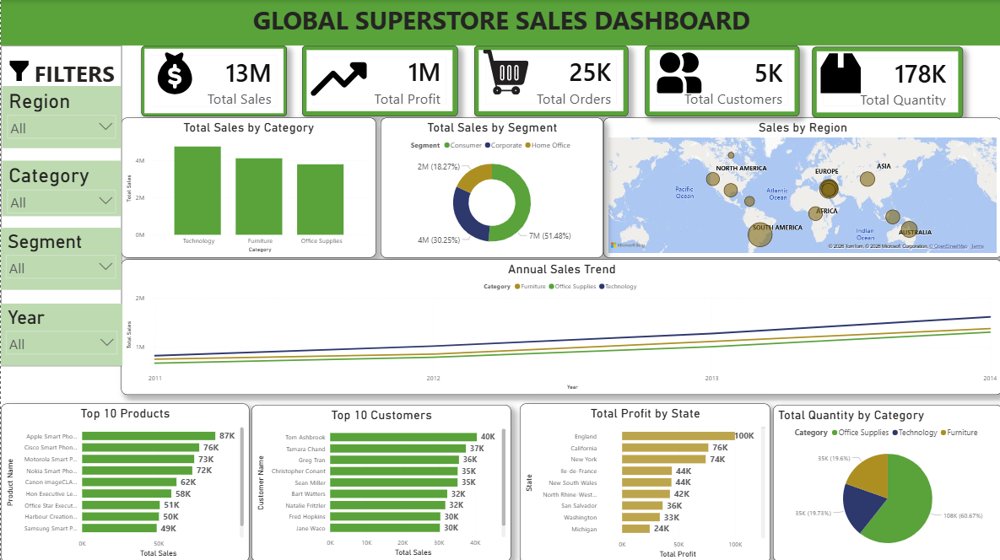

# Global Superstore Sales Dashboard (Power BI)

## Project Overview

This Power BI dashboard analyzes sales performance using the Global Superstore Sales dataset.

## Dashboard Features

- Total Sales
-Total Profit
-Total Orders
-Total Customers
-Total quantity
-Sales by Region
-Sales by Category
-Sales by Segment
-Annual Sales Trend
-Top 10 Products
-Top 10 Customers
-Profit by State
-Quantity by Category
-Interactive Filters

## Tools Used

- Microsoft Power BI
- DAX
- Power Query
- CSV Dataset

## Key Insights

- Sales performance by region
- Profit analysis by state
- Customer purchasing trends
- Product category performans
- Annual sales trends

## Dashboard Preview

## Dataset

Global Superstore Sales Dataset

## Author
**Sewmini kaweesha Jayasinghe**

**Sewmini Kaweesha**
